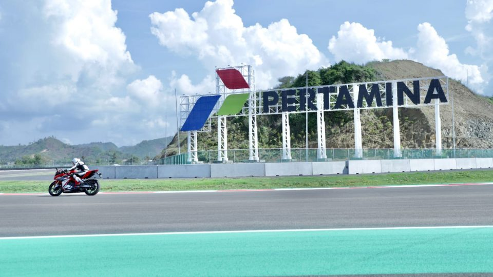
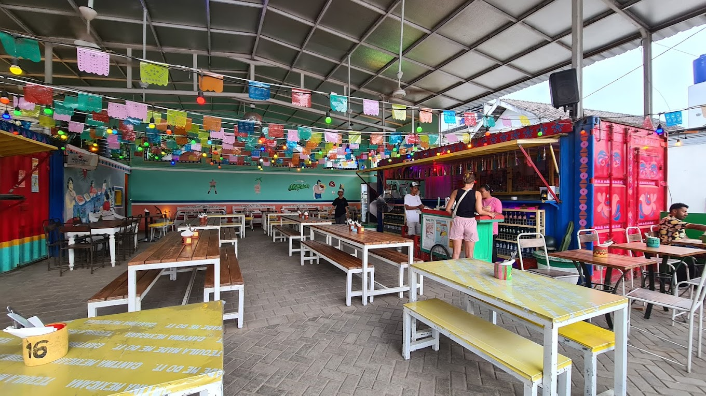
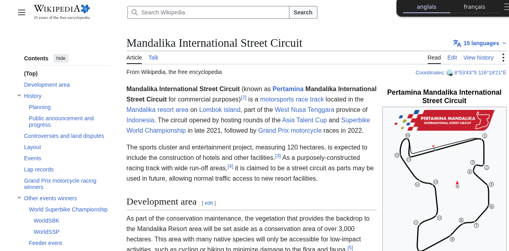
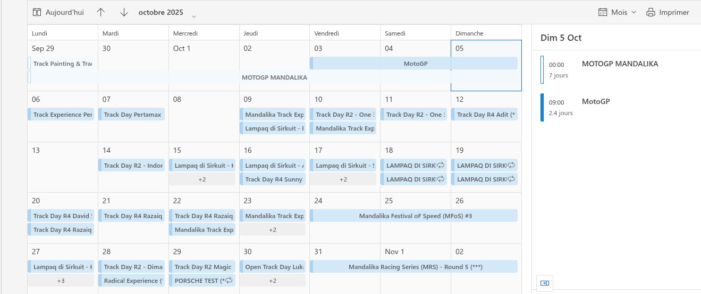
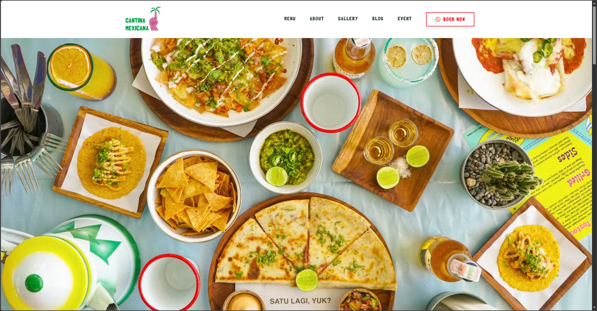
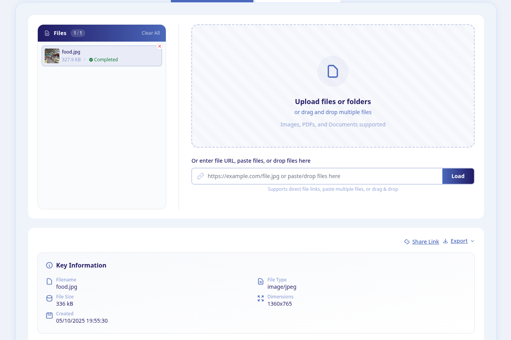
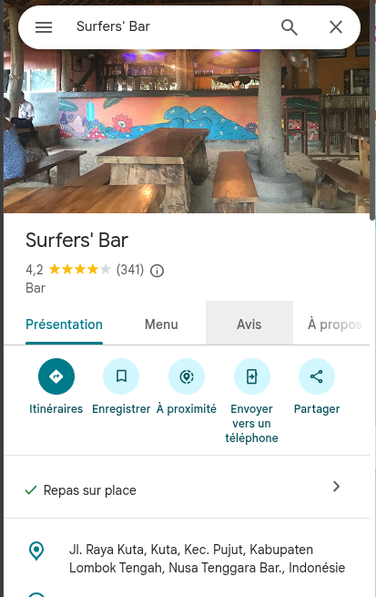
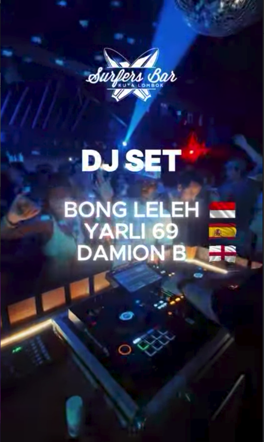
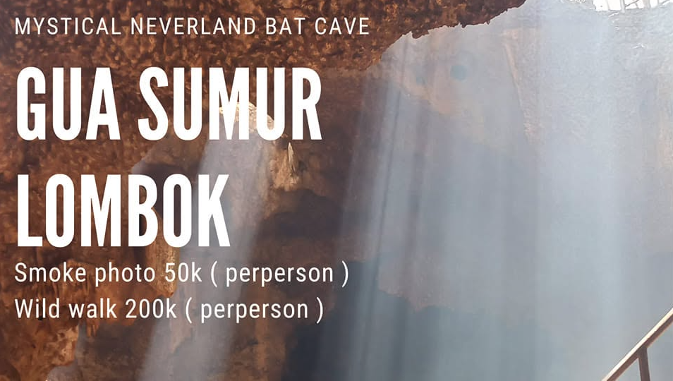
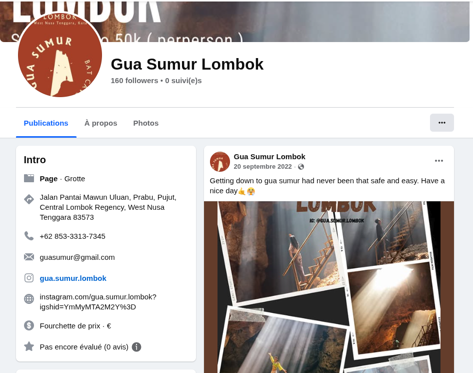

# Missing Person

---
**Used tools:** Google Image, EXIF tool

**Room :** [Missing Person](https://tryhackme.com/room/missingperson)

---

The challenge gives us 2 images. Let's analyze them !

---
#### Q1/
*What is the commercial name of this circuit?*
**Format: English, full commercial name.**

To find the name of the circuit, I used Google Image, wich gave me:
- Mandalika Circuit, Kenya, Indonesia
Then, by typing the circuit name in my browser, I found the wikipedia page that gave me the commercial name :
- Pertamina Mandalika International Street Circuit

---
#### Q2/
*When did the event take place?*
**Format: DD-DD/MM/YYYY.**

I went straight to https://exiftools.com to look for meta datas.
I found the exact date where the photo was taken: 05/10/2025
Next I looked for the official race dates at https://www.themandalikagp.com. We find that the MotoGP is 3 days long, from the 03/10/25 to the 05/10/25

---
#### Q3/
*He told me he ate delicious Mexican food. What is the name of the restaurant?*

Again, we use Google Image, and here is the restaurant name: Cantina Mexicana

---
#### Q4/
*At what time was this photo taken?*
**Format: HH:MM:SS.**

Here, again, I used https://exiftools.com/, and instantly found that the photo was taken at 7:55pm 30sec

---
#### Q5/
*He sent me a message, this is the last I heard from him: ”Went to this cool MotoGP after party, and became friends with one of the local DJs who played that night. We’re going to visit a cave tomorrow.”*
*What is the full address of the bar’s location?*

I went to Google Maps to find the bar, but there is a lot, so I looked for the motoGP afterparty in 2025, and found this https://www.facebook.com/surfersbarkutalombok/videos/get-ready-for-the-biggest-party-after-the-moto-gp-race%EF%B8%8F-sonday-5-october-2025-at/1447471409699330/.
Finally, I typed the bar name 'Surfer's Bar' in Google Maps, and copied the location.

---
#### Q6/
*What is the DJ's stage name?*

After further research about this bar, I found their Instagram: https://www.instagram.com/surfersbar.lombok/, where I found an interessing post about the motoGP afterparty, and the 3 DJ's names, and their nationalities:
- Bong Leleh 🇮🇩
- Yaru 69 🇪🇸
- Damion B 🏴󠁧󠁢󠁥󠁮󠁧󠁿

Since it is said that the DJ is local, the only awnser is Bong Leleh.

---
#### Q7/
*After digging into the DJ's other online accounts, what cave does he take tourists to?*

I found this question harder, but eventually I found an account with @bongleleh, called Gua Sumur (https://www.facebook.com/bongleleh/)
After looking at the posts, we see that Gua Sumur is indeed a cave.

---
#### Q8/
*What number did the DJ list for his tour business?*
**Format: Full number, no country code.**

In the same page, we have a phone number, +62 853-3313-7345.

---
