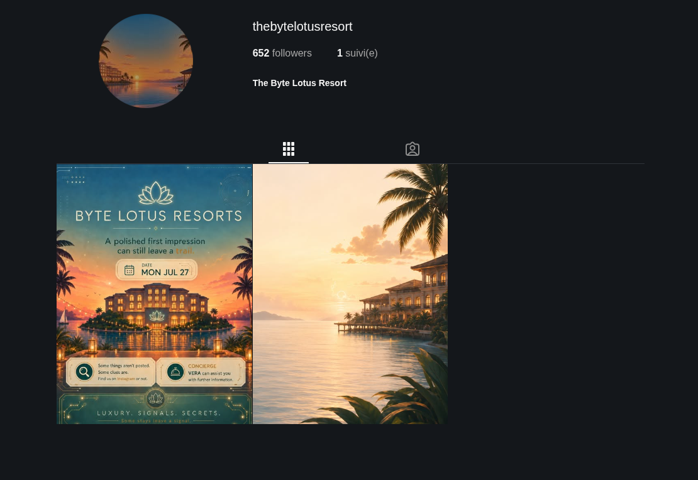
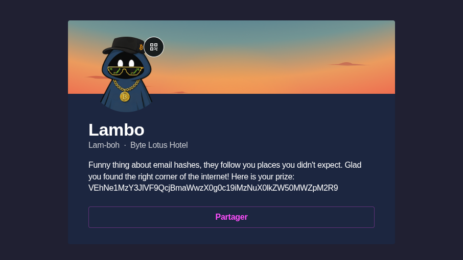
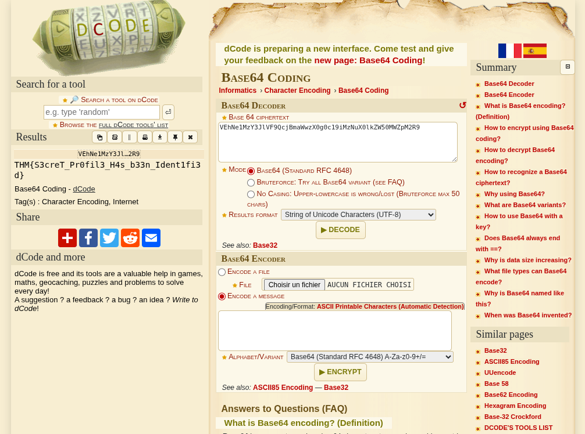

# Overheard at Breakfast

**Here is my step by step writeup of the 'Overheard at Breakfast' challenge.**

---
*The breakfast terrace is loud this morning, clinking cutlery, espresso machines, the usual chatter. One guest couldn't help but linger at a nearby table, seeing more of a conversation than they were meant to.*
*When the table's occupant stepped away for a refill, they seized the moment and grabbed a screenshot before it could disappear. Somewhere in that conversation is enough to track down an account nobody was supposed to find.*

- [ ] Analyze the provided conversation for identifying details
- [ ] Extract the relevant clues
- [ ] Locate the hidden account
- [ ] Submit the flag
---

The given image gives many clues:
- The resort name is Byte Lotus
- Ponzi is an Influenceur
- Ponzi is on a discord server with this tag : L3AK
- Lambo! has this email : lambobytelotushotel@gmail.com
- Lambo! used to use a free tool starting with G

---
First, I found an instagram account called "TheByteLotusResort", but found no interessing clues.

---
Then i was thinking the site starting with G was Github, but found no account.
So I put the email in https://whatsmyname.me/emailleak, where we find an account in gravatar: https://gravatar.com/cheerfullysongf28e3c3716

---
In bio we find the flag: VEhNe1MzY3JlVF9QcjBmaWwzX0g0c19iMzNuX0lkZW50MWZpM2R9, wich is encrypted. It is clearly Base64, so I put it in dcode, and here is the flag !

> Awnser : THM{S3creT_Pr0fil3_H4s_b33n_Ident1fi3d}
---
